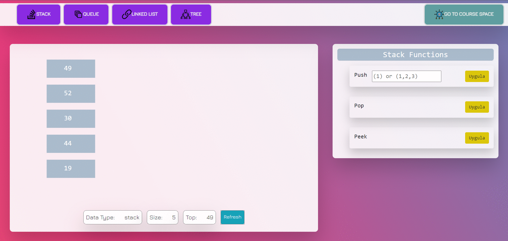
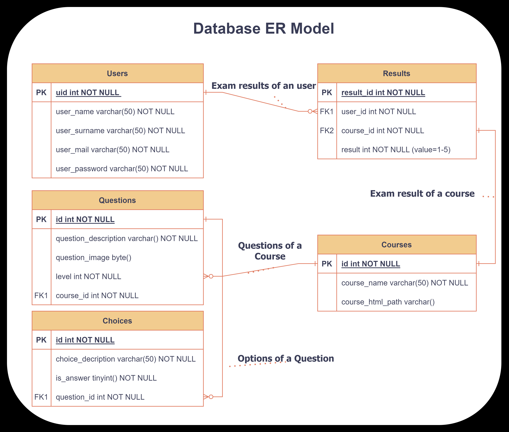
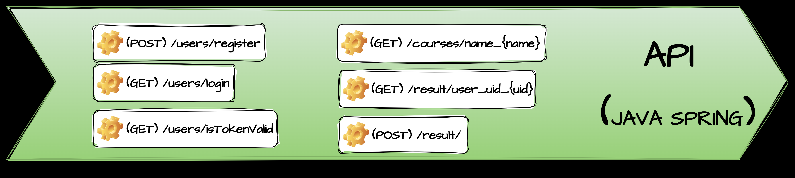

# visual-data-structure
<style>
r { color: Red }
o { color: Orange }
g { color: Green }
</style>

<div id="top"></div>

<p align="center">
<a href="https://github.com/kerimsenturk5734/visual-data-structure/blob/main/LICENSE.md" target="blank">

</a>
<a href="https://github.com/kerimsenturk5734/visual-data-structure/fork" target="blank">

</a>
<a href="https://github.com/kerimsenturk5734/visual-data-structure/stargazers" target="blank">

</a>
<a href="https://github.com/kerimsenturk5734/visual-data-structure/issues" target="blank">

</a>
<a href="https://github.com/kerimsenturk5734/visual-data-structure/pulls" target="blank">

</a>
</p>


<!-- PROJECT LOGO -->
<br />
<div align="center">

<h3 align="center">Visual Data Structure</h3>

  <p align="center">
    <a href="https://github.com/kerimsenturk5734/visual-data-structure">
    
    </a>

This repository contains a web application to visualize and teach the data structures.
<br/>

```🟥This project developed for "Project-1" course  in grade 3 term spring.🟥``` <br>

<hr>
<br />
<a href="https://github.com/kerimsenturk5734/visual-data-structure"><strong>Explore the docs »</strong></a>
<br/>
·<a href="https://github.com/kerimsenturk5734/visual-data-structure/issues">Report Bug</a>·
<br/>
<br/><br/>
<a href="https://github.com/kerimsenturk5734/visual-data-structure/blob/main/README-tr.md" target="_blank" rel="noreferrer">


```Türkçe```

</a>
<a href="https://github.com/kerimsenturk5734/visual-data-structure/blob/main/README.md" target="_blank" rel="noreferrer">
`

```English```

</a>
</div>

<!-- TABLE OF CONTENTS -->
<div align="left">
    <details>
      <summary><h1>Contents</h1></summary>
      <hr>
      <ol>
        <li>
          <a href="#about-the-project">About The Project</a>
          <ul>
            <li><a href="#abstract">Abstract</a></li>
            <li>
               <a href="#project-details">Project Details</a>
               <ul>
                  <li><a href="#database">Database</a></li>
                  <li><a href="#api">API</a></li>
                  <li><a href="#swagger">Frontend</a></li>
                  <li><a href="#react">Docker</a></li>
               </ul>
            </li>
            <li>
               <a href="#built-with">Built With</a> 
            </li>
          </ul>
        </li>
        <li>
          <a href="#getting-started">Getting Started</a>
          <ul>
            <li><a href="#prerequisites">Prerequisites</a></li>
            <li><a href="#installation">Installation</a></li>
          </ul>
        </li>
        <li><a href="#contact">Contact</a></li>
      </ol>
    </details>


<!-- ABOUT THE PROJECT -->
# About The Project

<!--projeyi anlat gif olarak kullanımını göster-->

## Abstract
<hr>

Data structures are important concepts that play a fundamental role in computer science. They are used to organize and effectively manipulate data. Data structures are designed to perform basic operations such as storing, accessing, inserting and deleting data items.
Effective use of data structures improves performance, optimizes memory usage, and provides an overall more efficient programming experience.
In this project, a web-based application was made to facilitate and facilitate learning by providing the educational content and visualization of such an important field.
   
   <p align="right">(<a href="#top">back to top</a>)</p>

   

### Project Details 
<hr>

#### Database
   <p>
      MySQL used in this project as a relational database. We have those tables and relations in this database what mentioned below:
      
   </p>
   

#### API
   <p>
      Spring Boot Framework used to develop API in this project. We have those endpoints and its JSON templates in this API what mentioned below
      
   </p>

#### Docker
   <p>
      Docker used to install project easily in this project. We have three subimage in visualdatastruct container;
      <br>
   </p>

   >**```app-client```** This is frontend react service in running on localhost:3000<br> 
   
   >**```app-server```** This is Spring Boot API service in running on localhost:8080<br>
   
   >**```docker-db-datastructurecourse```** This is MySQL server in running on localhost:3306<br>

### Built With
<hr>

## Getting Started

### Prerequisites
<hr>

1. Docker Engine 
2. 3000, 8080, 3306 ports must be available. If unavailable one of them you can change the ports inside ```./dockercompose.yml``` 

### Installation
<hr>

1. Clone the repo
   ```sh
   git clone https://github.com/kerimsenturk5734/visual-data-structure
   ```
2. ```File > Import > Install > From Existing Installation```  and select the project folder in Eclipse.(If you use IntelliJ, select eclipse project when importing.)

3. Finish.


<!-- CONTACT -->
## Contact
<hr>

<p align="center">
   <a href="mailto: kerimsenturk2002@outlook.com" target="blank"></a>
   <a href="https://twitter.com/kersenturk57" target="blank"></a>
   <a href="https://www.linkedin.com/in/kerim-%c5%9fent%c3%bcrk-784a3220a/" target="blank"></a>
   <a href="https://stackoverflow.com/users/16939669" target="blank"></a>
   <a href="https://www.instagram.com/s1r_ker1m/" target="blank"></a>
</p>
<hr>
<p align="right">(<a href="#top">back to top</a>)</p>
